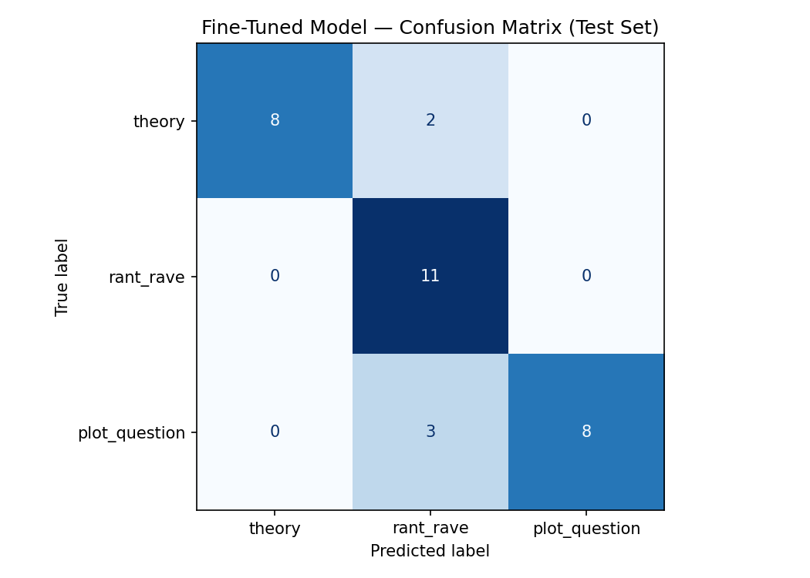

# TakeMeter — Manifest Fandom Post Classifier

**AI201 · Project 3**

A text classifier that sorts posts from the *Manifest* TV-show fandom (Reddit) into how the viewer is **engaging** with the show. It compares a fine-tuned DistilBERT model against a zero-shot Groq baseline.

## Community & task

[*Manifest*](https://en.wikipedia.org/wiki/Manifest_(TV_series)) is an NBC/Netflix mystery drama about the passengers of Flight 828, who disappear and return 5½ years later with visions called "Callings." Because the show is one long mystery, fans engage in three clearly different ways, which become the labels:

| Label | Meaning |
|---|---|
| `theory` | A hypothesis or prediction about the show's mysteries. |
| `rant_rave` | A mainly emotional reaction — liking or disliking a character, relationship, or plot point. |
| `plot_question` | A factual question about something the viewer missed or found confusing. |

Full label definitions, edge cases, and the annotation rules are in [planning.md](planning.md).

## Dataset

- **Source:** Reddit (r/Manifest and related Manifest threads). Public posts only.
- **Size:** 210 examples — `plot_question` 72, `rant_rave` 70, `theory` 68.
- **File:** [manifest_reviews.csv](manifest_reviews.csv) (`text`, `label`, `source`, `notes`).
- **Split:** 70 / 15 / 15 train / val / test, stratified by label (handled by the notebook).
- The `notes` column flags borderline posts; the 19 hardest are also collected in [ambiguous_review.csv](ambiguous_review.csv).

## How to run

Open the notebook in Google Colab with a **T4 GPU** runtime, upload `manifest_reviews.csv`, add your `GROQ_API_KEY` to Colab Secrets, and run the cells top to bottom. Fine-tuning takes 5–15 minutes.

---

## Results

| Model | Accuracy | Macro-F1 |
|---|---|---|
| Zero-shot baseline (Groq, `llama-3.3-70b-versatile`) | 0.875 | 0.87 |
| Fine-tuned DistilBERT | 0.844 | 0.85 |

On this test set the **fine-tuned model slightly underperformed the zero-shot baseline** (0.85 vs 0.87 macro-F1). See the comparison below — the result is more nuanced than the headline number.

### Baseline (zero-shot Groq) — reflection

**Overall:** 0.875 accuracy, 0.87 macro-F1 on the 32-example test set. All 32 responses parsed cleanly (no unparseable outputs).

Per-class metrics:

| Label | Precision | Recall | F1 | Support |
|---|---|---|---|---|
| theory | 0.91 | 1.00 | 0.95 | 10 |
| rant_rave | 0.79 | 1.00 | 0.88 | 11 |
| plot_question | 1.00 | 0.64 | 0.78 | 11 |

**Where it struggled:** the weakness is entirely in **`plot_question` recall (0.64)** — it caught only 7 of 11 factual questions. The other two labels had perfect recall. Since `plot_question` precision was 1.00, the problem is one-directional: real questions are **leaking out** into the other labels, not the reverse.

**Where they went:** `rant_rave` precision dropped to 0.79 (~3 false positives) and `theory` to 0.91 (~1 false positive) — accounting for exactly the 4 missed questions:
- ~3 questions misread as **`rant_rave`** → likely *complaints shaped like a question* ("Why is the casting so terrible?").
- ~1 question misread as **`theory`** → a *question that's really arguing a point*.

This is exactly the boundary [planning.md](planning.md) predicted: the baseline leans on emotional tone and lore content instead of the question's actual intent.

**Hypothesis to test after fine-tuning:** fine-tuning should **raise `plot_question` recall** and tighten `rant_rave`/`theory` precision, because the model will learn the surface patterns of genuine questions rather than guessing from tone. If `plot_question` recall stays low, that points to too few question examples on the hard boundary — a data problem, not a model problem.

### Fine-tuned DistilBERT — results

**Overall:** 0.844 accuracy, 0.85 macro-F1 on the 32-example test set.

| Label | Precision | Recall | F1 | Support |
|---|---|---|---|---|
| theory | 1.00 | 0.80 | 0.89 | 10 |
| rant_rave | 0.69 | 1.00 | 0.81 | 11 |
| plot_question | 1.00 | 0.73 | 0.84 | 11 |

**What the model learned:** all 5 errors were predicted **`rant_rave`** (2 true `theory`, 3 true `plot_question`), and every one came at very low confidence (0.34–0.38, barely above the 0.33 random floor for 3 classes). `rant_rave` precision fell to 0.69 while its recall hit 1.00 — i.e. the model uses `rant_rave` as a **fallback bucket** for posts it can't confidently place. `theory` and `plot_question` both kept perfect precision (1.00): when the model *does* commit to those labels it is right, it just commits too rarely.

### Comparison

| Metric | Baseline | Fine-tuned | Change |
|---|---|---|---|
| Macro-F1 | 0.87 | 0.85 | ▼ 0.02 |
| `plot_question` recall | 0.64 | 0.73 | ▲ 0.09 |
| `rant_rave` precision | 0.79 | 0.69 | ▼ 0.10 |
| `theory` recall | 1.00 | 0.80 | ▼ 0.20 |

**Was the hypothesis confirmed? Partially.** I predicted fine-tuning would raise `plot_question` recall — and it did (0.64 → 0.73). But it did **not** improve overall: the model traded that gain for a new, worse failure mode. Where the *baseline* leaked questions into multiple labels based on tone, the *fine-tuned* model collapses almost everything it's unsure about into `rant_rave`, now also pulling in clean `theory` posts (`theory` recall dropped 1.00 → 0.80).

**Why this happened — the data problem the hypothesis flagged.** With only ~150 training examples, DistilBERT didn't learn the `theory`/`plot_question` boundary well enough to be confident, so it defaults to the largest, most lexically varied class (`rant_rave`). The near-random confidences (~0.34) confirm under-training, not genuine ambiguity. This matches the planning.md prediction: if `plot_question` recall stayed weak after fine-tuning, the bottleneck is **too few examples on the hard boundary**, not the model. The fix is more data (especially emotionally-worded questions and plainly-stated theories), not more epochs.

---

## Error analysis

All 5 of the fine-tuned model's mistakes were predicted `rant_rave` at low confidence. I analyzed three that show the *different reasons* this happened.

**1. Emotional framing on a factual question** — `plot_question` → `rant_rave` (conf 0.34)
> "I'm still mad I never found out what happened to the comatose passengers. Did they wake up? How did the government explain their disappearances? Where are they now? I have so many questions."

This is a cluster of genuine factual questions, but it opens with "I'm still mad." The model latched onto the emotional lead word and bucketed it as a rant. This is exactly the `rant_rave` vs `plot_question` edge case from planning.md — and I had flagged this specific post in [ambiguous_review.csv](ambiguous_review.csv). The lesson: emotional *tone* is overriding the question *intent*, which means I need more training examples of frustrated-but-factual questions.

**2. A question that wraps a theory** — `plot_question` → `rant_rave` (conf 0.34)
> "How did the major know that the passengers' minds were connected as soon as they landed? Remember: in season 1 she kidnapped the passengers... This suggests that the government was involved..."

Per my annotation rule I labeled this `plot_question` (the lead intent is "how did she know?"), but it also argues a point, so it sits right on the `theory`↔`plot_question` line. The model didn't pick `theory` *or* `plot_question` — it gave up and chose `rant_rave` at near-random confidence. This is the boundary planning.md predicted would be hardest, and it confirms the model lacks enough examples to resolve it.

**3. A clean theory the model still missed** — `theory` → `rant_rave` (conf 0.35)
> "My theory is the sapphire is just the physical anchor for the Callings. Whoever holds it can broadcast or block them, which is exactly why Angelina could fake them once she got a shard."

This is the *surprising* one: it literally starts with "My theory is" and lays out a clear mechanism — it is not a genuine edge case. The model misclassifying it (and at 0.35 confidence) shows the failure isn't really about ambiguity; it's **under-training**. With only ~150 examples the model never built a confident `theory` representation, so a textbook theory still fell into the `rant_rave` fallback bucket. This is the strongest evidence that the fix is more data, not better labels.

**Verification:** I read each misclassified post in full against my planning.md definitions to confirm my original labels were correct before drawing these conclusions — the errors are the model's, not mislabeled data.

---

## Hyperparameters

Used the notebook defaults (3 epochs, learning rate 2e-5, batch size 16). _Note here if you changed any values and why._

---

## AI usage disclosure

I labeled every example in the dataset myself. I used an AI assistant to:
- Help clean up and format the dataset CSV (assigning the section labels I had grouped, fixing quoting), and flag borderline posts for me to re-check — I made the final label call on every post.
- Stress-test my label definitions before annotating (generating boundary posts).
- Help write the Groq classification prompt and draft these write-ups, which I reviewed and edited.
- Help spot patterns across the fine-tuned model's wrong predictions. I verified every pattern by reading each misclassified post against my planning.md definitions myself before writing it up.
